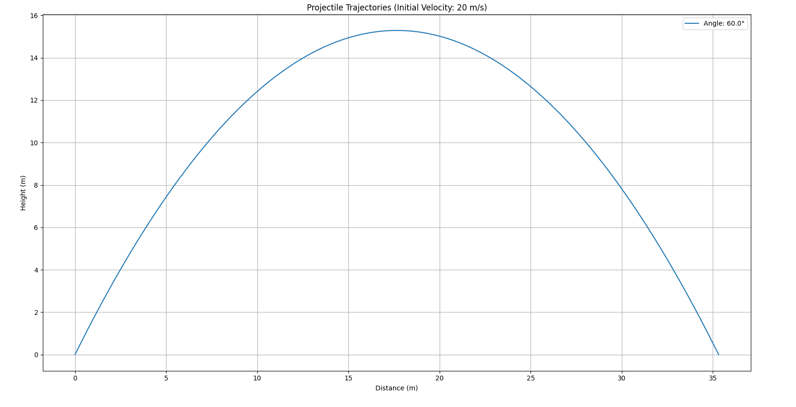
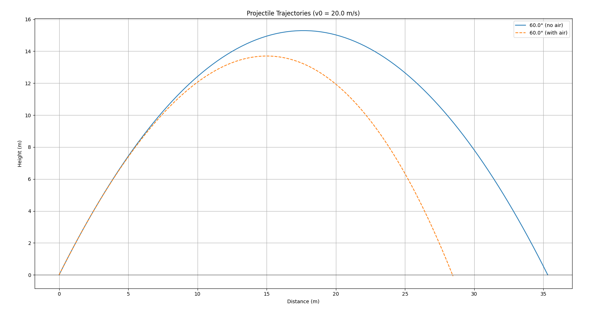
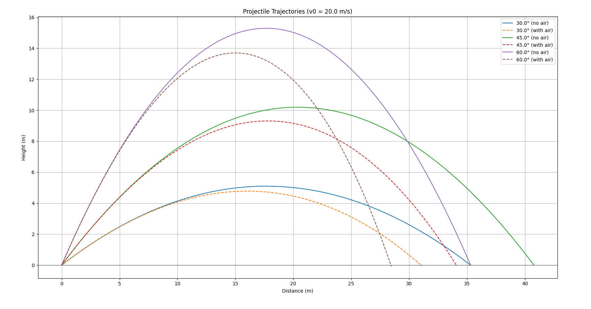

# Theoretical Basis: Projectile Motion

## 1. Motion of a Projectile
When a projectile (such as a ball, bullet, or rocket) is launched at an angle to the horizontal, it follows a parabolic trajectory. This occurs due to two forces:

- The horizontal velocity remains constant (if we don't take air resistance).
- The vertical velocity changes due to gravity.

### Key Equations of Motion
#### Horizontal coordinate (x):
$$
x = v_0 \cos(\theta) t
$$
where:
- $v_0$ is the initial velocity,
- $\theta$ is the launch angle,
- $t$ is the time.

#### Vertical coordinate (y):
$$
y = v_0 \sin(\theta) t - \frac{1}{2} g t^2
$$

where:
- $g$ is the acceleration due to gravity (typically $9.81 \text{ m/s}^2$).

and therefore our graph will be parabola and look like this:


---

## 2. Differential Equations with Air Resistance
**Modified equations (b = 0.1):**
When air resistance (drag force proportional to velocity) is included:

**Modified equations (b = 0.1):**
$$
m{x}'' = -b{x}' \\
$$

$$
m{y}'' = -mg - b{y}'
$$

**First-order system:**
1. Horizontal:
$$
{x}' = v_x \\
$$

$$
{v}_x' = {x}'' = -\frac{b}{m}v_x
$$

2. Vertical:
$$
{y}' = v_y \\
$$

$$
{v}_y' = {y}'' = -g - \frac{b}{m}v_y
$$
---

## 3. Analytical Solution with Air Resistance
When air resistance is considered, the equations of motion become more complex. The drag force opposes the motion and is typically proportional to the velocity (for low speeds). The analytical solutions for horizontal x(t) and vertical y(t) positions are:

### Horizontal position:
$$
x(t) = \frac{v_x0} m b \left(1 - e^{-\frac{b}{m} t}\right)
$$

where:
- $v_{x0} = v_0 \cos(\theta)$ is the initial horizontal velocity,
- $b$ is the drag coefficient,
- $m$ is the mass of the projectile.

### Vertical position:
$$
y(t) = \left(\frac{v_{y0} m}{b} + \frac{m^2 g}{b^2}\right) \left(1 - e^{-\frac{b}{m} t}\right) - \frac{mg}{b} t
$$

where:
- $v_{y0} = v_0 \sin(\theta)$ is the initial vertical velocity.

- The horizontal motion is no longer linear due to the exponential decay term.
- The vertical motion includes a terminal velocity term ($\frac{mg}{b}$) as $t \to \infty$.

### Trajectory Equation (y as function of x)
By solving the x(t) equation for t and substituting into y(t), we get the trajectory equation:
$$ y(x) = \left(\frac{mg}{b v_{0x}} + \frac{v_{0y}}{v_{0x}}\right)x + \frac{m^2g}{b^2}\ln\left(1 - \frac{b x}{m v_{0x}}\right) $$

and now, with air resistance, our graph will look like this:


## 4. Python code for simulation
Also, to better understand projectile motion, I wrote a Python script that simulates and visualizes the trajectory of our projectile. The script plots the parabolic path of a projectile based on different launch angles and initial velocities, which you can write by yourself. It uses the `matplotlib` and `numpy` libraries to generate the graphs. Here is the code:

```
import numpy as np
import matplotlib.pyplot as plt

def calculate_trajectory(v0, angle, g=9.81, b=0.1, with_air=False):
    angle_rad = np.radians(angle)
    
    if not with_air:
        t_flight = 2 * v0 * np.sin(angle_rad) / g
        t = np.linspace(0, t_flight, 100)
        x = v0 * np.cos(angle_rad) * t
        y = v0 * np.sin(angle_rad) * t - 0.5 * g * t**2
    else:
        def y_func(t):
            return (v0*np.sin(angle_rad) + g/b)*(1-np.exp(-b*t))/b - g*t/b
        
        t_flight = 0
        dt = 0.01
        while y_func(t_flight) >= 0:
            t_flight += dt
        
        t = np.linspace(0, t_flight, 100)
        x = (v0 * np.cos(angle_rad) * (1 - np.exp(-b*t))) / b
        y = y_func(t)
    
    return x, y

v0 = float(input("Enter initial velocity (m/s): "))
angles = list(map(float, input("Enter angles (degrees, space-separated): ").split()))

plt.figure(figsize=(10, 6))
for angle in angles:
    x, y = calculate_trajectory(v0, angle, with_air=False)
    plt.plot(x, y, label=f'{angle}° (no air)')
    
    x_air, y_air = calculate_trajectory(v0, angle, with_air=True)
    plt.plot(x_air, y_air, '--', label=f'{angle}° (with air)')

plt.title(f'Projectile Trajectories (v0 = {v0} m/s)')
plt.xlabel('Distance (m)')
plt.ylabel('Height (m)')
plt.axhline(0, color='black', linestyle='-', linewidth=0.5) 
plt.legend()
plt.grid(True)
plt.show()
```
- This code creates a graph that shows the trajectory of a projectile, with and without air resistance, when launched from different angles and with different initial speeds, you can enter these values ​​yourself. Also on this graph are 2 axes, distance and height, which show us exactly how high and far the projectile flew, here is the graph:



and also one additional (opposite) python code where you write only one angle, but more than one starting velocity:
```
import numpy as np
import matplotlib.pyplot as plt

def calculate_trajectory(v0, angle, g=9.81, b=0.1, with_air=False):
    angle_rad = np.radians(angle)

    if not with_air:
        t_flight = 2 * v0 * np.sin(angle_rad) / g
        t = np.linspace(0, t_flight, 100)
        x = v0 * np.cos(angle_rad) * t
        y = v0 * np.sin(angle_rad) * t - 0.5 * g * t**2
    else:
        def y_func(t):
            return (v0*np.sin(angle_rad) + g/b)*(1-np.exp(-b*t))/b - g*t/b

        t_flight = 0
        dt = 0.01
        while y_func(t_flight) >= 0:
            t_flight += dt

        t = np.linspace(0, t_flight, 100)
        x = (v0 * np.cos(angle_rad) * (1 - np.exp(-b*t))) / b
        y = y_func(t)

    return x, y

angle = float(input("Enter angle (degrees): "))
v0_list = list(map(float, input("Enter initial velocities (m/s, space-separated): ").split()))

plt.figure(figsize=(10, 6))
for v0 in v0_list:
    x, y = calculate_trajectory(v0, angle, with_air=False)
    plt.plot(x, y, label=f'v0={v0} m/s (no air)')

    x_air, y_air = calculate_trajectory(v0, angle, with_air=True)
    plt.plot(x_air, y_air, '--', label=f'v0={v0} m/s (with air)')

plt.title(f'Projectile Trajectories (angle = {angle}°)')
plt.xlabel('Distance (m)')
plt.ylabel('Height (m)')
plt.axhline(0, color='black', linestyle='-', linewidth=0.5) 
plt.legend()
plt.grid(True)
plt.show()
```
and here is the graph:


---
## 5. Brief description, how this code works

This code simulates and plots projectile trajectories with and without air resistance. Here's a brief breakdown:

### 1.Function calculate_trajectory:

* Computes the x (horizontal) and y (vertical) positions of a projectile over time.

* Without air resistance: Uses basic kinematic equations for projectile motion.

* With air resistance: Uses more complex equations accounting for drag (exponential decay terms).

* Determines flight time differently for each case.

### 2.User Input:

* Takes initial velocity (v0) and multiple launch angles as input.

### 3.Plotting:

* For each angle, calculates and plots two trajectories:

    * Solid line: No air resistance (ideal case)

    * Dashed line: With air resistance (more realistic)

* Adds labels, grid, and other plot decorations.

The key difference is that air resistance reduces the projectile's range and height, which is clearly visible in the plotted trajectories. The code allows comparison between ideal and air-resistant motion for multiple angles simultaneously.


## Google Colab Link (with Python code): https://colab.research.google.com/drive/1ZFv3n-_qu1Iq8BA62Z_PlupG6cccJkd3?usp=sharing
