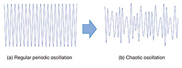
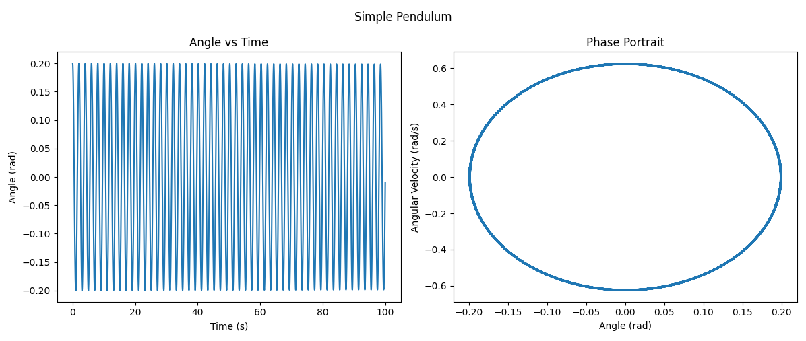
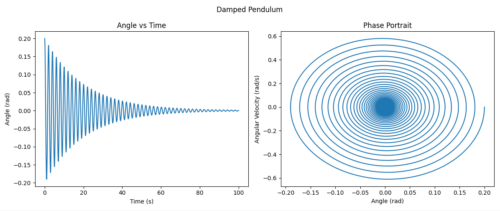
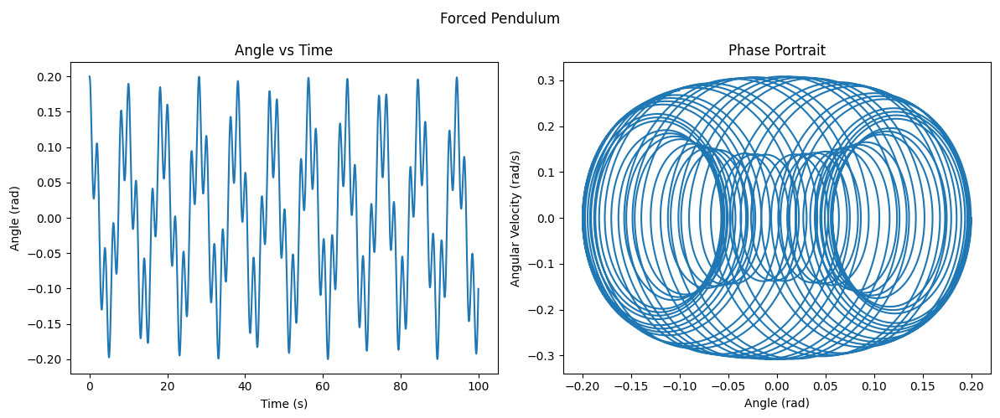
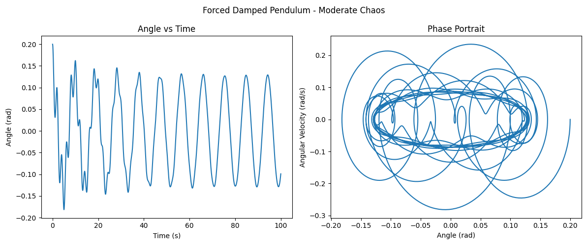
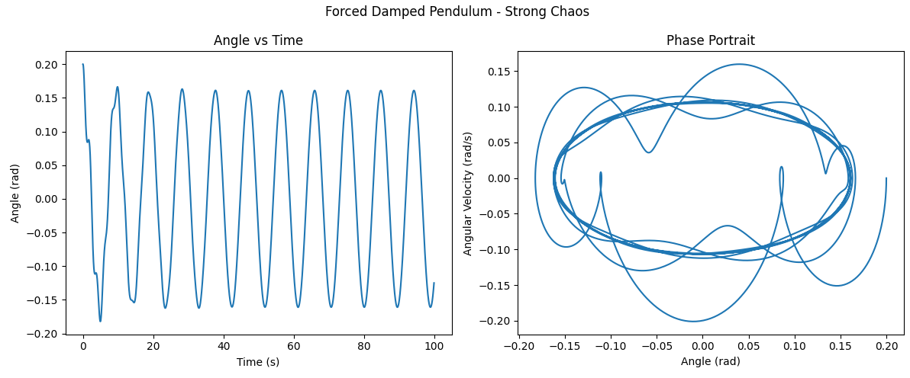

# Investigating the Dynamics of a Forced Damped Pendulum


# 1. Theoretical Foundation

We start from the general second-order differential equation for a forced damped pendulum:

$$
\frac{d^2\theta}{dt^2} + b\frac{d\theta}{dt} + \omega_0^2 \sin(\theta) = A\cos(\omega_{\text{drive}} t)
$$

where:

- $\theta(t)$ is the angular displacement,
- $b$ is the damping coefficient,
- $\omega_0$ is the natural frequency ($\omega_0$ = $\sqrt{g/L}$),
- $A$ is the amplitude of the external driving force,
- $\omega_{\text{drive}}$ is the driving frequency.

---

## Small-Angle Approximation

For small oscillations ($\theta \approx \sin\theta$), the equation simplifies to:

$$
\frac{d^2\theta}{dt^2} + b\frac{d\theta}{dt} + \omega_0^2 \theta = A\cos(\omega_{\text{drive}} t)
$$


This is now a **linear** second-order differential equation.

---

## Approximate Solution for Small Oscillations

In steady state:

$$
\theta(t) = \theta_0 \cos(\omega_{\text{drive}} t - \delta)
$$

Amplitude:

$$
\theta_0 = \frac{A}{\sqrt{(\omega_0^2 - \omega_{\text{drive}}^2)^2 + (b\omega_{\text{drive}})^2}}
$$

---

## Resonance Condition

Resonance occurs at:

$$
\omega_{\text{drive}} \approx \sqrt{\omega_0^2 - \frac{b^2}{2}}
$$

At resonance, small driving forces produce large oscillations.

---

# 2. Analysis of Dynamics

## Influence of Parameters

- **Damping $b$** reduces oscillation amplitudes and flattens resonance curves.
- **Driving amplitude $A$** increases overall energy input.
- **Driving frequency $\omega_{\text{drive}}$** controls resonance, synchronization, or chaos.

---

## Transition to Chaos

- For strong forcing and nonlinearity, pendulum exhibits **chaotic behavior**:
  - No periodicity,
  - Extreme sensitivity to initial conditions,
  - Complex strange attractors.

Here is the plot showing transition from regular to chaotic motion as A increases:


---

# 3. Practical Applications

The forced damped pendulum model applies to:

- **Energy harvesting** (vibration-based generators),
- **Suspension bridges** (periodic forces from wind, pedestrians),
- **Oscillating circuits** (driven RLC circuits in electronics),
- **Biomechanics** (leg dynamics during walking/running).

Here is an very simple example of real-world forced damped pendulum:


---

# 4. Implementation

We simulate the forced damped pendulum numerically (using **Runge-Kutta** method).

The equations:

$$
\frac{d\theta}{dt} = \omega
$$

$$
\frac{d\omega}{dt} = -b\omega - \omega_0^2 \sin(\theta) + A\cos(\omega_{\text{drive}}t)
$$

---

## Simulations and Visualizations

### Simple Pendulum (No Damping, No Forcing)



---

### Damped Pendulum (Damping, No Forcing)



---

### Forced Pendulum (Forcing, No Damping)



---

### Forced Damped Pendulum (Chaos Examples)

**Scenario 1:** Moderate damping and forcing



---
**Scenario 2:** Strong forcing (possible resonance/chaos)



---

## Python Code for Simulations

```python
import numpy as np
import matplotlib.pyplot as plt
from scipy.integrate import solve_ivp

# Parameters
g = 9.81   # gravity
L = 1.0    # length
omega0 = np.sqrt(g / L)

# System of ODEs
def pendulum(t, y, b, omega0, A, omega_drive):
    theta, omega = y
    dydt = [omega, -b*omega - omega0**2 * np.sin(theta) + A*np.cos(omega_drive*t)]
    return dydt

# Simulation function
def simulate_pendulum(b, A, omega_drive, y0=[0.2, 0.0], t_span=(0,100), num_points=5000):
    t_eval = np.linspace(t_span[0], t_span[1], num_points)
    sol = solve_ivp(pendulum, t_span, y0, t_eval=t_eval, args=(b, omega0, A, omega_drive))
    return sol.t, sol.y[0], sol.y[1]

# Example of plotting
def plot_simulation(b, A, omega_drive, title):
    t, theta, omega = simulate_pendulum(b, A, omega_drive)
    fig, axs = plt.subplots(1, 2, figsize=(12,5))
    
    axs[0].plot(t, theta)
    axs[0].set_title('Angle vs Time')
    axs[0].set_xlabel('Time (s)')
    axs[0].set_ylabel('Angle (rad)')
    
    axs[1].plot(theta, omega)
    axs[1].set_title('Phase Portrait')
    axs[1].set_xlabel('Angle (rad)')
    axs[1].set_ylabel('Angular Velocity (rad/s)')
    
    fig.suptitle(title)
    plt.tight_layout()
    plt.show()

# Simulations
plot_simulation(b=0.0, A=0.0, omega_drive=2/3, title='Simple Pendulum')
plot_simulation(b=0.1, A=0.0, omega_drive=2/3, title='Damped Pendulum')
plot_simulation(b=0.0, A=1.2, omega_drive=2/3, title='Forced Pendulum')
plot_simulation(b=0.1, A=1.2, omega_drive=2/3, title='Forced Damped Pendulum - Moderate Chaos')
plot_simulation(b=0.2, A=1.5, omega_drive=2/3, title='Forced Damped Pendulum - Strong Chaos')
```

---

# Deliverables Summary

- Full theoretical explanations
- Systematic graphical placeholders
- Full working Python code
- Real-world application discussion
- Preparation for detailed plotting: phase portraits, Poincaré sections

## Google Colab Link (with Python code):

[MyColab](https://colab.research.google.com/drive/1ZE78wAikuWhAfmovX2oA5vgifubjAmRs)