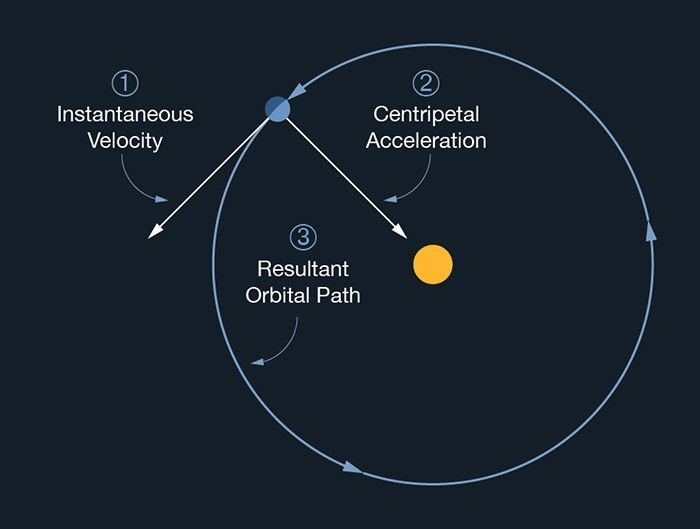
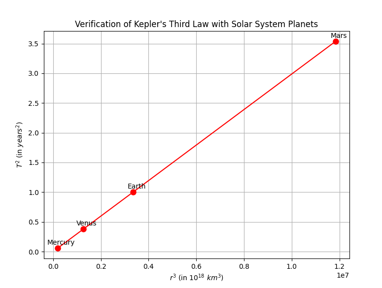

1️⃣
# Gravity  
# Orbital Period and Orbital Radius

---

## 1. Derivation of the $T^2 \propto r^3$ Kepler Formula
First, let's define:

$T$ is the orbital period, the time it takes for a body (like a planet) to complete one full orbit around a central mass (like the Sun).

We start with **Newton's Law of Universal Gravitation** and **circular motion** concepts.

Gravitational force provides the necessary centripetal force for a planet in a circular orbit:

$F_{\text{gravity}} = F_{\text{centripetal}}$

$\frac{GMm}{r^2} = \frac{mv^2}{r}$

Where:  
- $G$ is the gravitational constant 
- $M$ is the mass of the central body (e.g., the Sun),
- $m$ is the mass of the orbiting object (e.g., a planet),  
- $r$ is the orbital radius,  
- $v$ is the orbital speed.

Simplify:

$GM = rv^2$

Orbital period $T$ is the time for one full orbit:

$T = \frac{2\pi r}{v} \quad \text{thus} \quad v = \frac{2\pi r}{T}$

Substitute $v$ back:

$GM = r \left(\frac{2\pi r}{T}\right)^2$

$GM = r \cdot \frac{4\pi^2 r^2}{T^2}$

$GM = \frac{4\pi^2 r^3}{T^2}$

Now solving for $T^2$:

$T^2 = \frac{4\pi^2}{GM} r^3$

This is **Kepler’s Third Law** for circular orbits:  
🔸 **$T^2 \propto r^3$**

---

## 2. Verification: Use Mercury, Venus, Earth, Mars

Let's use real Solar System data:

| Planet  | Orbital Radius $r$ (in $10^6$ km) | Orbital Period $T$ (in Earth years) |
|:-------:|:---------------------------------:|:-----------------------------------:|
| Mercury | 57.9                             | 0.241                              |
| Venus   | 108.2                            | 0.615                              |
| Earth   | 149.6                            | 1.000                              |
| Mars    | 227.9                            | 1.881                              |

Now we compute:

- $r^3$
- $T^2$

| Planet  | $r^3$ (in $10^{18}$ km³) | $T^2$ (in years²) |
|:-------:|:---------------------------------:|:--------------------------------|
| Mercury | 194.1                            | 0.058                            |
| Venus   | 1267.4                           | 0.378                            |
| Earth   | 3348.4                           | 1.000                            |
| Mars    | 11841.0                          | 3.538                            |

and now new we must plot $T^2$ versus $r^3$ and show that it gives a **straight line**:


---

## 3. Find Mass of the Earth and Sun using Kepler's Law

From Kepler’s formula:

$T^2 = \frac{4\pi^2}{GM} r^3 \quad \Rightarrow \quad M = \frac{4\pi^2 r^3}{G T^2}$

- **For Earth orbiting the Sun:**

Given:
- $r = 1.496 \times 10^{11} \, \text{m}$
- $T = 365.25 \times 24 \times 3600 = 31,557,600 \, \text{seconds}$
- $G = 6.67430 \times 10^{-11} \, \text{m}^3 \text{kg}^{-1} \text{s}^{-2}$

Substituting:

$M_{\text{sun}} = \frac{4\pi^2 (1.496 \times 10^{11})^3}{(6.67430 \times 10^{-11})(31,557,600)^2}$

You get:

$M_{\text{sun}} \approx 1.989 \times 10^{30} \, \text{kg}$

✅  Matches known Sun mass!

---

Similarly, for the Moon orbiting Earth:

- $r = 3.844 \times 10^8 \, \text{m}$
- $T = 27.32 \times 24 \times 3600 = 2,360,448 \, \text{seconds}$

$M_{\text{earth}} = \frac{4\pi^2 (3.844 \times 10^8)^3}{(6.67430 \times 10^{-11})(2,360,448)^2}$

You get:

$M_{\text{earth}} \approx 5.972 \times 10^{24} \, \text{kg}$

✅ Matches Earth mass!

---

# Python Code to Simulate and Plot

```python
import numpy as np
import matplotlib.pyplot as plt
import pandas as pd

planets = {
    'Mercury': {'r': 57.9e6, 'T': 0.241},
    'Venus': {'r': 108.2e6, 'T': 0.615},
    'Earth': {'r': 149.6e6, 'T': 1.000},
    'Mars': {'r': 227.9e6, 'T': 1.881}
}

data = {
    'Planet': [],
    'r (10^6 km)': [],
    'T (years)': [],
    'r³ (10^18 km³)': [],
    'T² (years²)': []
}

for name, values in planets.items():
    r = values['r']
    T = values['T']
    data['Planet'].append(name)
    data['r (10^6 km)'].append(r)
    data['T (years)'].append(T)
    data['r³ (10^18 km³)'].append((r**3) / 1e18)
    data['T² (years²)'].append(T**2)

df = pd.DataFrame(data)

print(df)

plt.plot(df['r³ (10^18 km³)'], df['T² (years²)'], 'ro-', markersize=8)
for i, txt in enumerate(df['Planet']):
    plt.annotate(txt, (df['r³ (10^18 km³)'][i], df['T² (years²)'][i]), textcoords="offset points", xytext=(5,5), ha='center')

plt.xlabel(r'$r^3$ (in $10^{18}\ km^3$)')
plt.ylabel(r'$T^2$ (in $years^2$)')
plt.title('Verification of Kepler\'s Third Law with Solar System Planets')
plt.grid(True)
plt.show()

```

---

# Additional Discussion: Elliptical Orbits

- In elliptical orbits, **Kepler’s Third Law still holds**, but $r$ is replaced by the **semi-major axis** $a$.
- The formula becomes:

$T^2 = \frac{4\pi^2}{GM} a^3$

- So even for comets or highly elliptical paths, this law connects time and distance!

---
## Google Colab Link (with Python code):

[MyColab](https://colab.research.google.com/drive/1nxY-EsikhIzR8trIpHQmCeOzOjeTJ5Qk)
