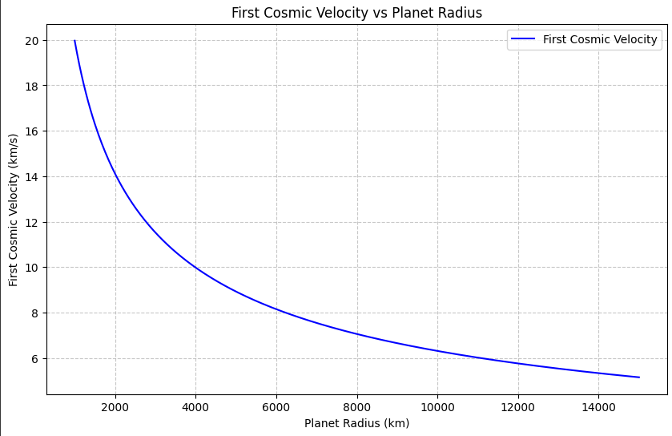
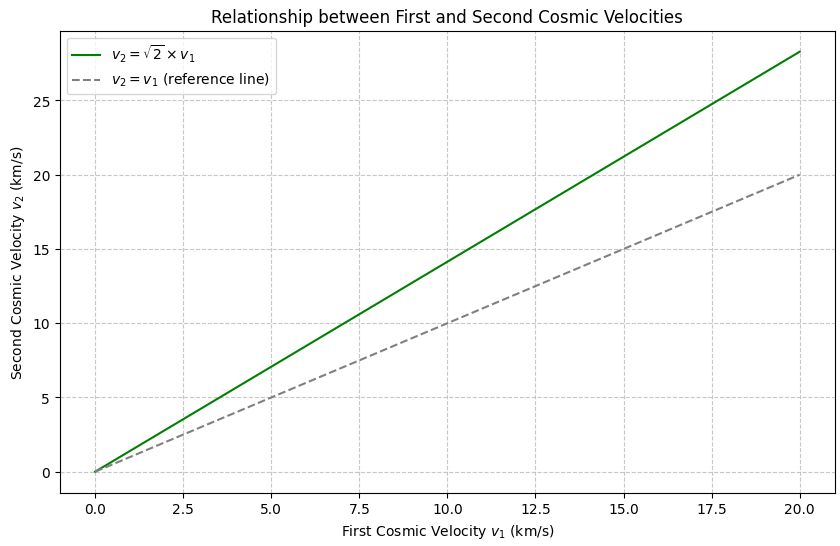
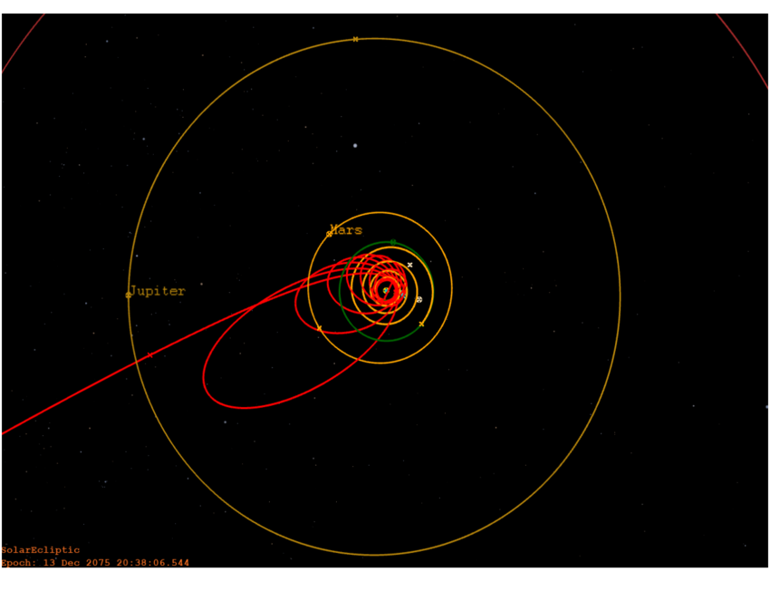
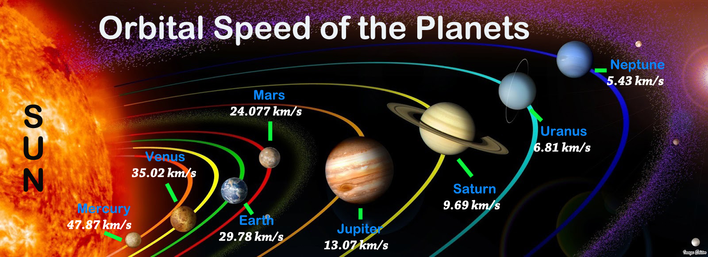
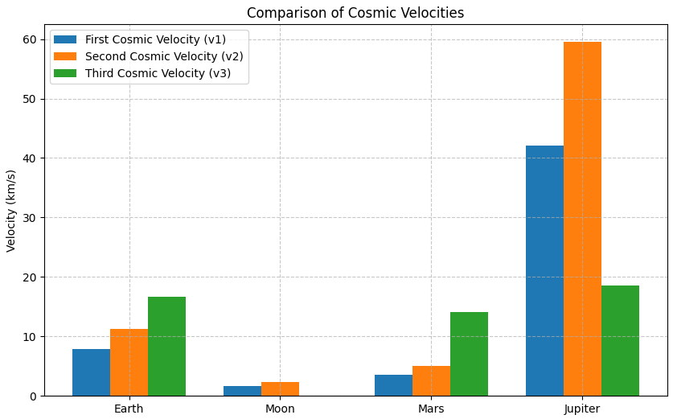

# GRAVITY PROBLEM 2: Escape Velocities and Cosmic Velocities

## Definitions and Physical Meaning

1. **First Cosmic Velocity (Orbital Velocity)**  
   - Minimum speed to enter a circular orbit near the surface of a planet, without propulsion.

2. **Second Cosmic Velocity (Escape Velocity)**  
   - Minimum speed to completely overcome the planet’s gravitational field without further propulsion.

3. **Third Cosmic Velocity (Interplanetary Escape Velocity)**  
   - Minimum speed needed to escape the gravitational field of the **Sun** starting from the orbit around the planet.

---

## Mathematical Derivations

## 1. First Cosmic Velocity Derivation (v₁)

An object in a circular orbit experiences gravitational force as the centripetal force:

$$ \frac{G M m}{R^2} = \frac{m v_1^2}{R} $$

where:
- $ G $ = gravitational constant
- $ M $ = mass of the planet
- $ m $ = mass of the object
- $ R $ = radius of the planet
- $ v_1 $ = first cosmic velocity

Solving for $ v_1 $:

$$ v_1 = \sqrt{\frac{G M}{R}} $$

Velocity vs Planet Radius for first cosmic velocity:


---

## 2. Second Cosmic Velocity Derivation (v₂)

The object needs kinetic energy to match the gravitational potential energy:

$$ \frac{1}{2} m v_2^2 = \frac{G M m}{R} $$

Solving for $ v_2 $:

$$ v_2 = \sqrt{\frac{2 G M}{R}} $$

Notice that:

$$ v_2 = \sqrt{2} \times v_1 $$

Relationship between first and second cosmic velocities:



---

## 3. Third Cosmic Velocity Derivation (v₃)

To escape from the **Sun's** gravity starting from orbit around Earth:
- First, object must reach Earth escape velocity ($v_2$)
- Then, it must have enough additional velocity to escape the Sun’s gravitational field.

Approximate derivation:

$$ v_3 \approx \sqrt{v_{e,Sun}^2 - v_{orb,Earth}^2} $$

where:
- $ v_{e,Sun} $ = escape velocity from Sun at Earth's orbit
- $ v_{orb,Earth} $ = Earth's orbital speed around the Sun

**More precisely:**  
Since Earth moves around the Sun, the spacecraft needs to cancel Earth’s orbital motion and then escape.

Also here is the escape trajectory from solar orbit:


---

## Values for Earth

| Quantity | Value |
|:---------|:------|
| Mass $ M_{\text{Earth}} $ | $ 5.972 \times 10^{24} \, \text{kg} $ |
| Radius $ R_{\text{Earth}} $ | $ 6.371 \times 10^6 \, \text{m} $ |
| Gravitational Constant $ G $ | $ 6.67430 \times 10^{-11} \, \text{m}^3 \text{kg}^{-1} \text{s}^{-2} $ |

Calculating:

$$ v_1 = \sqrt{\frac{6.67430 \times 10^{-11} \times 5.972 \times 10^{24}}{6.371 \times 10^6}} \approx 7.9 \, \text{km/s} $$

$$ v_2 = \sqrt{2} \times v_1 \approx 11.2 \, \text{km/s} $$

$$ v_3 \approx 16.7 \, \text{km/s} $$
---

## Visual/Data Comparison: Earth vs Moon, Mars, Jupiter

| Celestial Body | $ v_1 $ (km/s) | $ v_2 $ (km/s) | $ v_3 $ (km/s) (approximate) |
|:---------------|:---------------:|:---------------:|:-----------------------------:|
| **Earth**       | 7.9             | 11.2            | 16.7                         |
| **Moon**        | 1.68            | 2.38            | - (Moon orbiting Earth)       |
| **Mars**        | 3.55            | 5.03            | ~14.1                        |
| **Jupiter**     | 42.1            | 59.5            | ~18.5                        |

And here is the comparison of cosmic velocities for Earth, Moon, Mars, and Jupiter:



and also python graph:


---

## Graphical Representation
Comparison of Cosmic Velocities:
```python
import matplotlib.pyplot as plt

# Data
bodies = ['Earth', 'Moon', 'Mars', 'Jupiter']
v1 = [7.9, 1.68, 3.55, 42.1]
v2 = [11.2, 2.38, 5.03, 59.5]
v3 = [16.7, None, 14.1, 18.5]  # Moon doesn't have v3 in same sense

x = range(len(bodies))

# Plot
plt.figure(figsize=(10, 6))
plt.bar(x, v1, width=0.25, label='First Cosmic Velocity (v1)', align='center')
plt.bar([i + 0.25 for i in x], v2, width=0.25, label='Second Cosmic Velocity (v2)', align='center')
plt.bar([i + 0.5 for i in x], [v if v else 0 for v in v3], width=0.25, label='Third Cosmic Velocity (v3)', align='center')

plt.xticks([i + 0.25 for i in x], bodies)
plt.ylabel('Velocity (km/s)')
plt.title('Comparison of Cosmic Velocities')
plt.legend()
plt.grid(True, linestyle='--', alpha=0.7)
plt.show()
```
Velocity vs Planet Radius for first cosmic velocity python code:
```python
import numpy as np
import matplotlib.pyplot as plt

# Constants
G = 6.67430e-11  # gravitational constant in m^3 kg^-1 s^-2
M = 5.972e24     # mass of Earth in kg (we'll keep it constant for this graph)

# Generate a range of planet radii (in meters)
radii = np.linspace(1e6, 1.5e7, 500)  # from 1000 km to 15000 km

# Calculate first cosmic velocity for each radius
v1 = np.sqrt(G * M / radii)

# Convert velocity to km/s
v1_km_s = v1 / 1000

# Plotting
plt.figure(figsize=(10,6))
plt.plot(radii/1000, v1_km_s, label='First Cosmic Velocity', color='blue')  # radii in km
plt.xlabel('Planet Radius (km)')
plt.ylabel('First Cosmic Velocity (km/s)')
plt.title('First Cosmic Velocity vs Planet Radius')
plt.grid(True, linestyle='--', alpha=0.7)
plt.legend()
plt.show()
```
Relationship between first and second cosmic velocities:
```python
import numpy as np
import matplotlib.pyplot as plt

# Define a range of first cosmic velocities (v1) in km/s
v1 = np.linspace(0, 20, 500)

# Calculate second cosmic velocities (v2)
v2 = np.sqrt(2) * v1

# Plotting
plt.figure(figsize=(10,6))
plt.plot(v1, v2, label=r'$v_2 = \sqrt{2} \times v_1$', color='green')
plt.plot(v1, v1, linestyle='--', color='gray', label=r'$v_2 = v_1$ (reference line)')

plt.xlabel('First Cosmic Velocity $v_1$ (km/s)')
plt.ylabel('Second Cosmic Velocity $v_2$ (km/s)')
plt.title('Relationship between First and Second Cosmic Velocities')
plt.grid(True, linestyle='--', alpha=0.7)
plt.legend()
plt.show()

```
## Importance in Space Exploration

- **First Cosmic Velocity:** Satellites in low Earth orbit (e.g., ISS).
- **Second Cosmic Velocity:** Interplanetary missions (e.g., Apollo to the Moon).
- **Third Cosmic Velocity:** Interstellar probes (e.g., Voyager missions leaving the Solar System).

Understanding these velocities allows mission designers to optimize launch profiles and minimize fuel usage, which is crucial for cost-effective space exploration.

## Google Colab Link (with Python code):

[MyColab](https://colab.research.google.com/drive/1JZPTQXOrhr4n1rEL3FBN_q27PF7mI7s1)
