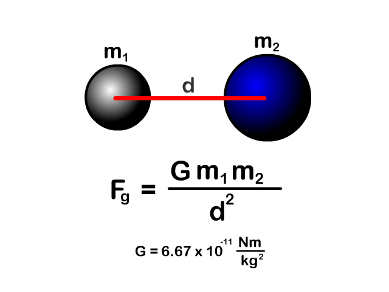
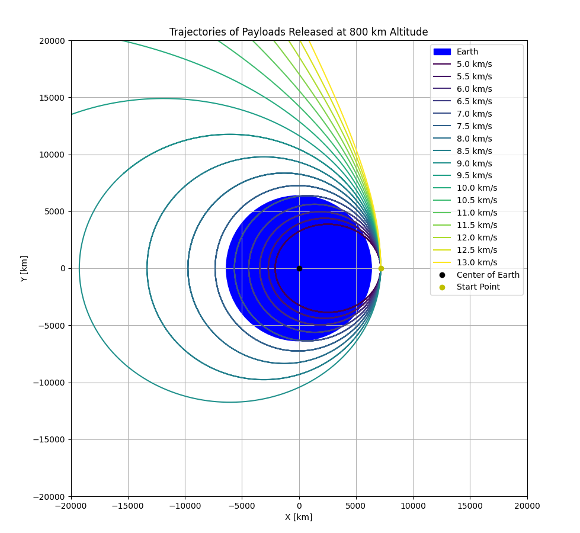

# Problem 3

# Trajectories of a Freely Released Payload Near Earth

## 1. Objective

Analyze and simulate the trajectories of a payload released from a certain height (800 km above Earth's surface) with various initial horizontal velocities. Determine whether the resulting path is **elliptical, parabolic, or hyperbolic**, and relate these outcomes to space mission concepts like **orbital insertion, reentry, or escape velocity**.

---

## 2. Physical Background

We analyze the motion under **Newton’s Law of Universal Gravitation**:

$$
\vec{F}_g = -\frac{G M m}{r^2} \hat{r}
$$

Where:

* $G = 6.674 \times 10^{-11} \ \text{m}^3 \text{kg}^{-1} \text{s}^{-2}$
* $M$ is Earth's mass ($5.972 \times 10^{24} \ \text{kg}$)
* $r$ is the distance from Earth's center
* The motion is governed by Newton’s Second Law: $\vec{F} = m \vec{a}$

---

## 3.  Initial Conditions

* **Altitude**: 800 km above Earth's surface
* **Earth Radius**: 6371 km → Initial radial distance: $R_0 = 7171 \ \text{km} = 7.171 \times 10^6 \ \text{m}$
* **Initial Velocities**: from **5 km/s to 13 km/s** in steps of 0.5 km/s
* **Initial Position**: on the right side of Earth (positive x-axis)
* **Initial Velocity Direction**: purely tangential (positive y-direction)
---

## 4.  Python Simulation Code

```python
import numpy as np
import matplotlib.pyplot as plt
from scipy.integrate import solve_ivp

G = 6.67430e-11     
M = 5.972e24        
R_earth = 6371e3    
altitude = 800e3     
r0 = R_earth + altitude  

t_span = (0, 20000)
t_eval = np.linspace(t_span[0], t_span[1], 10000)

def gravity(t, y):
    x, vx, y_, vy = y
    r = np.sqrt(x**2 + y_**2)
    ax = -G * M * x / r**3
    ay = -G * M * y_ / r**3
    return [vx, ax, vy, ay]

velocities_kms = np.arange(5, 13.5, 0.5)
colors = plt.cm.viridis(np.linspace(0, 1, len(velocities_kms)))

fig, ax = plt.subplots(figsize=(10, 10))
ax.add_patch(plt.Circle((0, 0), R_earth / 1e3, color='blue', label='Earth'))

for i, v_kms in enumerate(velocities_kms):
    vx0 = 0
    vy0 = v_kms * 1000
    y0 = [r0, vx0, 0, vy0] 

    sol = solve_ivp(gravity, t_span, y0, t_eval=t_eval, rtol=1e-8)
    x = sol.y[0]
    y = sol.y[2]

    ax.plot(x / 1e3, y / 1e3, label=f'{v_kms:.1f} km/s', color=colors[i])

ax.plot(0, 0, 'ko', label='Center of Earth')
ax.plot(r0 / 1e3, 0, 'yo', label='Start Point')

ax.set_aspect('equal')
ax.set_xlim(-20000, 20000)
ax.set_ylim(-20000, 20000)
ax.set_xlabel('X [km]')
ax.set_ylabel('Y [km]')
ax.set_title('Trajectories of Payloads Released at 800 km Altitude')
ax.legend(loc='upper right')
plt.grid(True)
plt.show()
```

---

## 5. Observations & Analysis

* **Velocities < 7.8 km/s**: Suborbital trajectories → reentry.
* **Around 7.8 km/s**: Circular or low Earth orbits (LEO).
* **Between 8–11.2 km/s**: Elliptical or escape trajectories.
* **> 11.2 km/s**: Hyperbolic escape — the payload leaves Earth's gravitational field.

---

## 6.  Real-World Applications

* **Orbital insertion**: Matching the orbital speed for satellite deployment.
* **Escape missions**: Reaching speeds above 11.2 km/s for moon or Mars missions.
* **Controlled reentry**: Lower speeds for deorbiting and returning safely.

---

## 7. Conclusion

This simulation provides insights into how varying horizontal velocities affect the type of trajectory a payload follows. By understanding these outcomes, one can effectively plan orbital maneuvers, insertions, and escapes in real space missions.

[MyColab](https://colab.research.google.com/drive/1cAjtLmDVIHgMFJUM0uNMMg3DMz38aD7G)
