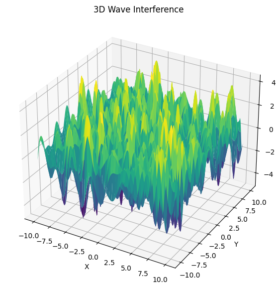
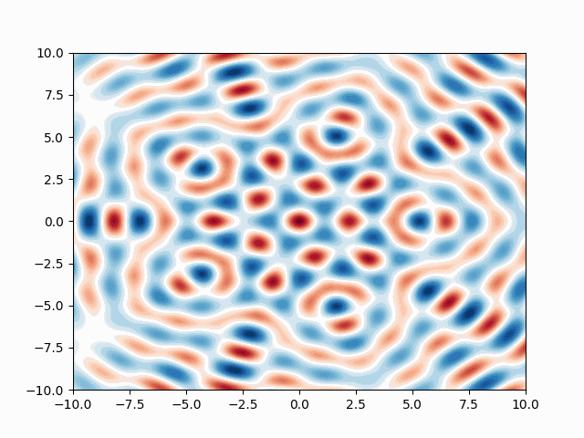

## Problem 1: Interference Patterns on a Water Surface

### 1. Motivation

Interference occurs when waves from different sources overlap, creating new patterns. On a water surface, this can be observed when ripples from different points meet, forming distinctive interference patterns.

Studying these patterns helps us:
- Understand constructive and destructive interference
- Visualize coherent wave interactions
- Relate wave phase, distance, and geometry

This task provides a hands-on simulation of superposed wave behaviors from multiple point sources arranged in polygonal formations.

---

### 2. Problem Statement

You will analyze the interference patterns formed on the water surface due to the **superposition of waves** emitted from point sources placed at the **vertices of a regular polygon**.

---

### 3. Steps

1. select a Regular Polygon  
We'll use a **regular pentagon** (5 vertices) as the base case.

2.  Position the Sources  
Each wave source is placed at a vertex of the pentagon.

3.  Wave Equation for a Single Source  
The surface displacement from one point source is described by:

$$
z_i(x, y, t) = A \cdot \cos(k \cdot r_i - \omega \cdot t + \phi)
$$

Where:
- $A$: Amplitude  
- $k = \frac{2\pi}{\lambda}$: Wave number  
- $\omega = 2\pi f$: Angular frequency  
- $r_i = \sqrt{(x - x_i)^2 + (y - y_i)^2}$: Distance from the i-th source  
- $\phi$: Initial phase (0 for all sources)

4. Superposition of Waves  
The total displacement is the sum:

$$
z(x, y, t) = \sum_{i=1}^{N} z_i(x, y, t)
$$

---

### 4. Interpretation

**Constructive Interference**: Where waves from sources arrive in-phase — peaks reinforce each other.  
**Destructive Interference**: Where waves arrive out-of-phase — peaks cancel troughs.

By placing sources at polygon vertices, symmetrical interference patterns emerge, showing how spatial wave arrangements shape the resulting surface.


---

### 5. Python Simulation Code

```python
import numpy as np
import matplotlib.pyplot as plt
from matplotlib import animation

# Parameters
A = 1          # Amplitude
wavelength = 2 # Wavelength
frequency = 1  # Frequency
omega = 2 * np.pi * frequency
k = 2 * np.pi / wavelength
phi = 0

# Grid
x = np.linspace(-10, 10, 400)
y = np.linspace(-10, 10, 400)
X, Y = np.meshgrid(x, y)

# Polygon: Regular Pentagon
N = 5
radius = 5
sources = [(radius * np.cos(2*np.pi*i/N), radius * np.sin(2*np.pi*i/N)) for i in range(N)]

# Superposition Function
def wave_sum(t):
    Z = np.zeros_like(X)
    for (x0, y0) in sources:
        r = np.sqrt((X - x0)**2 + (Y - y0)**2) + 1e-6  # avoid div by 0
        Z += A * np.cos(k * r - omega * t + phi)
    return Z

# Heatmap at fixed time
t0 = 0
Z = wave_sum(t0)

plt.figure(figsize=(8, 6))
plt.contourf(X, Y, Z, levels=100, cmap='RdBu')
plt.colorbar(label='Displacement')
plt.title("Wave Interference Pattern (Pentagon Sources)")
plt.xlabel("x")
plt.ylabel("y")
plt.show()

# 3D Plot
from mpl_toolkits.mplot3d import Axes3D

fig = plt.figure(figsize=(10, 7))
ax = fig.add_subplot(111, projection='3d')
ax.plot_surface(X, Y, Z, cmap='viridis', edgecolor='none')
ax.set_title("3D Wave Interference")
ax.set_xlabel("X")
ax.set_ylabel("Y")
ax.set_zlabel("Amplitude")
plt.show()

# Animation (Optional GIF)
fig, ax = plt.subplots()
c = ax.contourf(X, Y, wave_sum(0), levels=100, cmap='RdBu')
def animate(i):
    ax.clear()
    Z = wave_sum(i * 0.1)
    ax.contourf(X, Y, Z, levels=100, cmap='RdBu')

ani = animation.FuncAnimation(fig, animate, frames=40, interval=100)
ani.save('wave_interference.gif', writer='pillow')
```

---

### 6. Deliverables

- Code simulating interference from polygon-placed wave sources  
- Heatmap and 3D plots illustrating constructive/destructive regions  
- Animated GIF showing wave evolution over time  
- Explanations of observed interference behaviors

---

### 7. Conclusion

This simulation gives a visual and interactive insight into how waves from multiple sources interact through **superposition**. It emphasizes the importance of geometry in creating symmetrical or complex wave patterns and helps in understanding real-world wave phenomena such as sound interference, water ripples, and even quantum wavefunctions.

[MyColab](https://colab.research.google.com/drive/1ZvYICRMS7f76DWBHNXaAfyvPAiiZymno)
