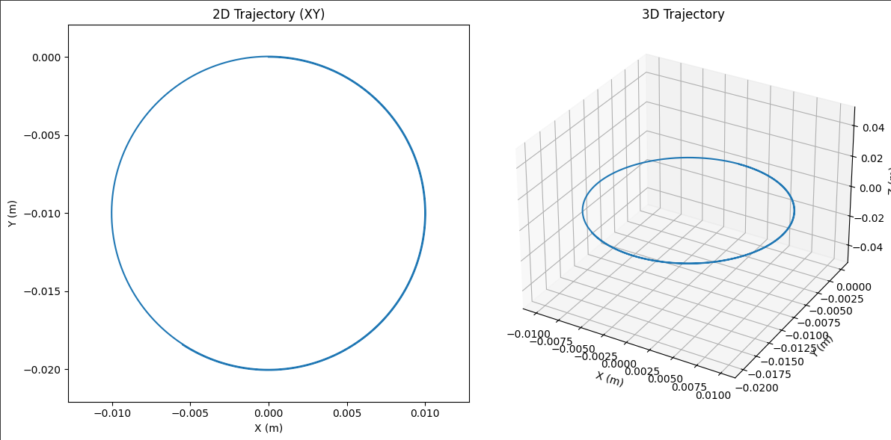

# Electromagnetism Lorentz Force Simulation

## 1. Exploration of Applications

The **Lorentz force**, given by:

$\vec{F} = q(\vec{E} + \vec{v} \times \vec{B})$

is crucial in:

* **Particle accelerators** – where magnetic fields steer high-energy particles.
* **Mass spectrometers** – which use $\vec{E}$ and $\vec{B}$ to separate ions by mass.
* **Plasma confinement** – e.g. in tokamaks, where particles spiral due to strong magnetic fields.
* **Astrophysics** – charged particles in cosmic fields follow complex paths due to Lorentz force.

Electric fields $\vec{E}$ accelerate charged particles, while magnetic fields $\vec{B}$ bend their trajectories perpendicularly to velocity.

---

## 2. Simulating Particle Motion

We simulate a particle with:

* $q = 1 \, \text{C}$
* $m = 1 \, \text{g} = 0.001 \, \text{kg}$

### Scenarios:

* **Uniform magnetic field only** – expect circular motion.
* **Uniform electric + magnetic field** – expect helical or drift paths.
* **Crossed $\vec{E} \perp \vec{B}$** – observe $\vec{E} \times \vec{B}$ drift.

---

## 3. Parameter Exploration

Parameters to vary:

* Magnetic field $\vec{B}$: magnitude and direction.
* Electric field $\vec{E}$
* Initial velocity $\vec{v}_0$
* Charge $q$ and mass $m$

Observe:

* **Larmor radius**: $r_L = \frac{mv}{|qB|}$
* **Drift velocity**: $\vec{v}_d = \frac{\vec{E} \times \vec{B}}{B^2}$

---

## 4. Visualization

* Plot **2D** (xy) and **3D** trajectories
* Circle, spiral in z-direction, or other interesting paths
* Emphasize physical concepts (e.g., radius, velocity vector)
* Simulation Output:


---

## Python Simulation Code

```python
import numpy as np
import matplotlib.pyplot as plt
from mpl_toolkits.mplot3d import Axes3D

# Constants
q = 1.0       # Charge [C]
m = 0.001     # Mass [kg]
dt = 1e-6     # Time step [s]
steps = 10000 # Number of steps

# Fields
E = np.array([0.0, 0.0, 0.0])   # Uniform electric field [V/m]
B = np.array([0.0, 0.0, 1.0])   # Uniform magnetic field [T]

# Initial conditions
v = np.array([10.0, 0.0, 0.0])  # Initial velocity [m/s]
r = np.array([0.0, 0.0, 0.0])   # Initial position [m]

# Trajectory
trajectory = [r.copy()]

# Euler method simulation
for _ in range(steps):
    F = q * (E + np.cross(v, B))         # Lorentz force
    a = F / m                            # Acceleration
    v = v + a * dt                       # Update velocity
    r = r + v * dt                       # Update position
    trajectory.append(r.copy())

trajectory = np.array(trajectory)

# Plotting
fig = plt.figure(figsize=(12,6))

# 2D projection
ax1 = fig.add_subplot(121)
ax1.plot(trajectory[:,0], trajectory[:,1])
ax1.set_title('2D Trajectory (XY)')
ax1.set_xlabel('X (m)')
ax1.set_ylabel('Y (m)')
ax1.axis('equal')

# 3D trajectory
ax2 = fig.add_subplot(122, projection='3d')
ax2.plot(trajectory[:,0], trajectory[:,1], trajectory[:,2])
ax2.set_title('3D Trajectory')
ax2.set_xlabel('X (m)')
ax2.set_ylabel('Y (m)')
ax2.set_zlabel('Z (m)')

plt.tight_layout()
plt.show()
```

---

## 🔍 Discussion

* In a **pure magnetic field**, the particle undergoes circular motion in a plane perpendicular to $\vec{B}$, due to the centripetal nature of the Lorentz force.
* Adding a **parallel electric field** induces spiral motion (helical path).
* In **crossed fields**, the particle drifts at velocity $\vec{v}_d = \vec{E} \times \vec{B}/B^2$ — used in devices like velocity selectors.
* The **Larmor radius** and **gyrofrequency** can be observed directly in the plotted paths.

---

[MyColab](https://colab.research.google.com/drive/1mKzx5NRdaniyCGZngB0npskZLA5BKDbT)
