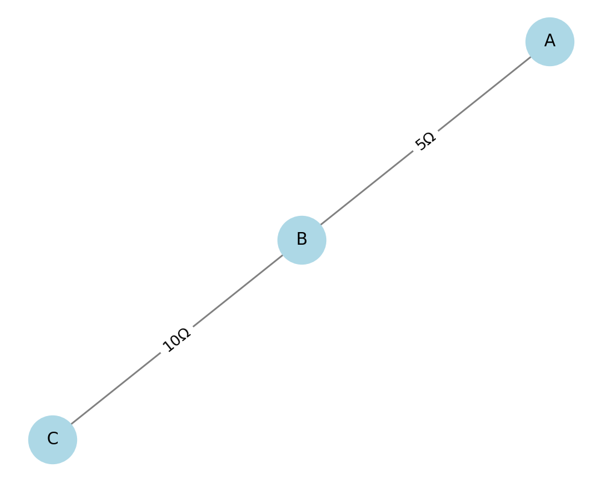
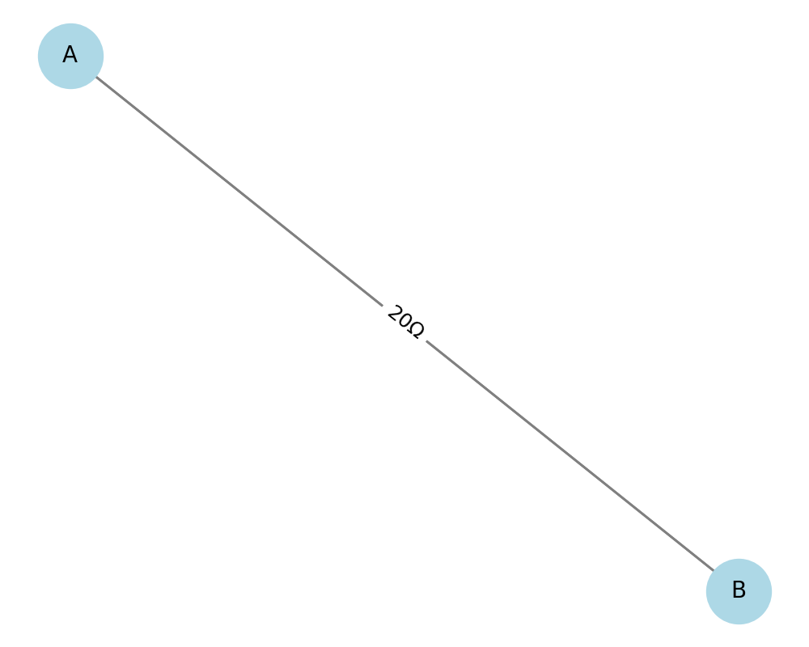
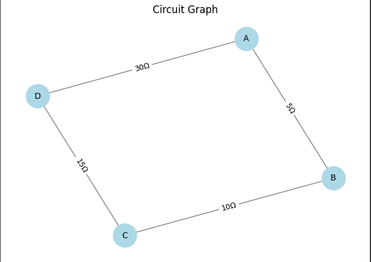

# Equivalent Resistance Using Graph Theory

## 1. Problem Statement

**Goal:** Compute the equivalent resistance between two nodes in a resistor network using graph theory.

---

## 2. Algorithm Explanation

We treat the resistor network as an undirected **weighted graph**, where:

- **Nodes** represent junctions in the circuit.
- **Edges** represent resistors with weights equal to resistance values.
- The task is to find the **equivalent resistance** between two specific nodes (source and target).

---

## 3. Key Reduction Rules

1. **Series Reduction:**
   If a node has exactly two neighbors and is not the source or target, we can collapse it:
   $R_eq = R1 + R2$

2. **Parallel Reduction:**
   If multiple edges connect the same pair of nodes:

   $1/R_eq = sum(1/Ri)$

3. **General Case:**
   Use **Kirchhoff's laws** and **linear algebra** to solve for node potentials and derive current, if needed. But for simplification and automation, we reduce the graph step by step using rules above.

---

## 4. Python Implementation (with NetworkX)

```python
import networkx as nx
import matplotlib.pyplot as plt

def combine_parallel_edges(G):
 to_add = []
 to_remove = []
 for u, v in G.edges():
     all_edges = G.get_edge_data(u, v)
     if all_edges and len(all_edges) > 1:
         total_inv = sum(1 / d['resistance'] for d in all_edges.values())
         req = 1 / total_inv
         to_add.append((u, v, {'resistance': req}))
         to_remove.extend((u, v, k) for k in all_edges)

 for u, v, k in to_remove:
     G.remove_edge(u, v, key=k)
 for u, v, data in to_add:
     G.add_edge(u, v, resistance=data['resistance'])

def reduce_series_nodes(G, source, target):
 changed = True
 while changed:
     changed = False
     for node in list(G.nodes()):
         if node in [source, target]:
             continue
         neighbors = list(G.neighbors(node))
         if len(neighbors) == 2:
             u, v = neighbors
             if G.number_of_edges(u, node) == 1 and G.number_of_edges(node, v) == 1:
                 r1 = G[u][node][0]['resistance']
                 r2 = G[node][v][0]['resistance']
                 G.add_edge(u, v, resistance=r1 + r2)
                 G.remove_node(node)
                 changed = True
                 break

def calculate_equivalent_resistance(G, source, target):
 combine_parallel_edges(G)
 reduce_series_nodes(G, source, target)
 if G.has_edge(source, target):
     return G[source][target][0]['resistance']
 else:
     return "Could not reduce the circuit to a single resistance."

def draw_circuit(G):
 pos = nx.spring_layout(G, seed=42)
 edge_labels = {(u, v): f"{d['resistance']}Ω" for u, v, d in G.edges(data=True)}

 plt.figure(figsize=(6, 4))
 nx.draw(G, pos, with_labels=True, node_color='lightblue', edge_color='gray', node_size=800, font_size=10)
 nx.draw_networkx_edge_labels(G, pos, edge_labels=edge_labels, font_size=9)
 plt.title("Circuit Graph")
 plt.axis('off')
 plt.show()

G = nx.MultiGraph()
G.add_edge('A', 'B', resistance=5)
G.add_edge('B', 'C', resistance=10)
G.add_edge('C', 'D', resistance=15)
G.add_edge('A', 'D', resistance=30)

draw_circuit(G)

print("Equivalent resistance from A to D:")
print(calculate_equivalent_resistance(G, 'A', 'D'))
```
---

## 5. Example Scenarios

### Example 1 – Series Only
$A --(5Ω)-- B --(10Ω)-- C$

Result: $`R_eq = 15Ω`$


### Example 2 – Parallel Only
$
A --(10Ω)-- B
A --(20Ω)-- B
$

Result: $R_eq = 1 / (1/10 + 1/20) = 6.67Ω$



### Example 3 – Mixed (like in code above)
$
A --(5Ω)-- B --(10Ω)-- C --(15Ω)-- D
A ----------------------------- D (30Ω)
$

Combined:

$R_(parallel) = 1 / (1/30 + 1/30) = 15Ω$

Equivalent resistance from A to D: 30Ω

---

## 6. Efficiency & Improvements

- **Time complexity:** Each reduction (series or parallel) is linear with respect to number of nodes/edges.
- **Can be improved with:**
  - Better pattern detection for mesh loops (needs Kirchhoff's matrix method).
  - Symbolic computation (e.g. using `sympy`) for algebraic analysis.

---

[MyColab](https://colab.research.google.com/drive/1N9GhH4rj1tMBkMUB1heCw_wN-RjVxabN)