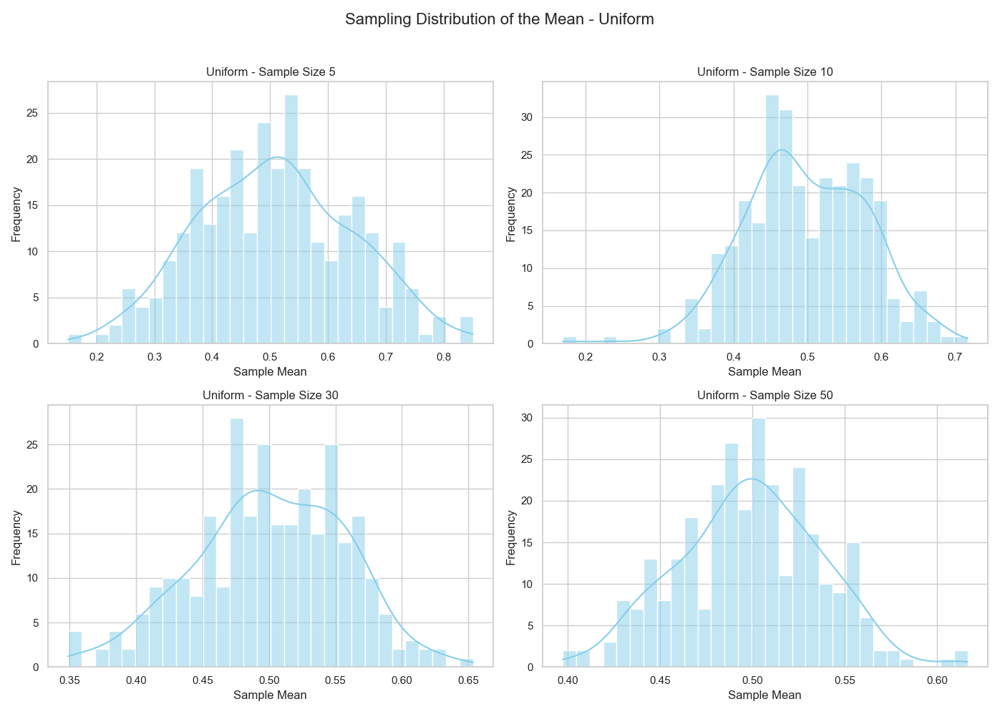
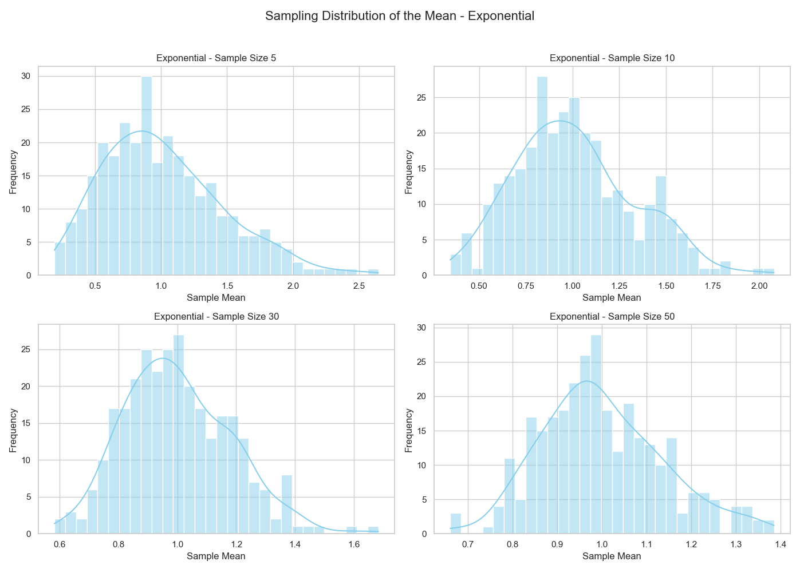
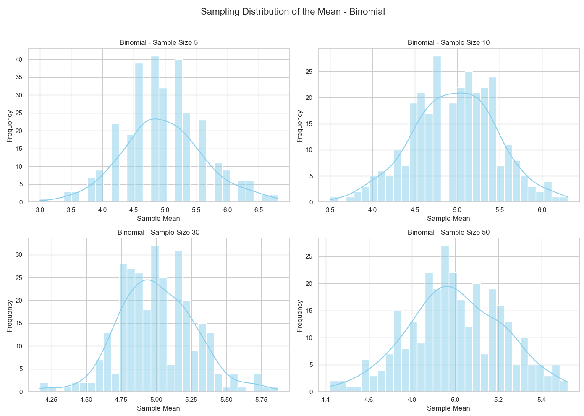

# 1️⃣

# Exploring the Central Limit Theorem through Simulations

## 1. Motivation

The Central Limit Theorem (CLT) states that the sampling distribution of the sample mean becomes approximately normal as the sample size increases, regardless of the shape of the population distribution. This principle underpins many statistical methods and is fundamental in real-world applications.

---

## 2. Simulating Sampling Distributions

We'll explore three types of population distributions:

* **Uniform distribution**: Evenly distributed values.
* **Exponential distribution**: Skewed, non-symmetric.
* **Binomial distribution**: Discrete with two outcomes.

Each distribution is simulated using a large population of 100,000 elements.

---

## 3. Sampling and Visualization

For each distribution, we take repeated random samples with the following sizes:

* 5, 10, 30, and 50

For each sample size, we repeat sampling 1000 times and calculate the **sample mean** to form the **sampling distribution**.

---

## 4. Parameter Exploration

We explore:

* How quickly the sampling distribution approaches normality as the sample size increases.
* How the **population’s variance** affects the spread of the sample mean distribution.

---

## 5. Practical Applications of CLT

* **Estimating population parameters**: Even if a population is not normally distributed, large enough samples allow valid inference using normal theory.
* **Quality control**: In manufacturing, averages of product measurements are used for control charts.
* **Financial modeling**: Portfolio returns often use the normal approximation via CLT.

---

## 6. Python Code for Simulation and Visualization

```python
import numpy as np
import matplotlib.pyplot as plt
import seaborn as sns

# Seaborn style for better visuals
sns.set(style="whitegrid")

# Parameters
sample_sizes = [5, 10, 30, 50]
n_simulations = 1000
population_size = 100000

# Distributions to explore
distributions = {
    "Uniform": np.random.uniform(0, 1, population_size),
    "Exponential": np.random.exponential(1, population_size),
    "Binomial": np.random.binomial(n=10, p=0.5, size=population_size)
}

# Plotting
for dist_name, population in distributions.items():
    plt.figure(figsize=(16, 10))
    for i, n in enumerate(sample_sizes, 1):
        sample_means = []
        for _ in range(n_simulations):
            sample = np.random.choice(population, size=n, replace=False)
            sample_means.append(np.mean(sample))
        plt.subplot(2, 2, i)
        sns.histplot(sample_means, bins=30, kde=True, color="skyblue")
        plt.title(f"{dist_name} Distribution - Sample Size {n}")
        plt.xlabel("Sample Mean")
        plt.ylabel("Frequency")
    plt.suptitle(f"Sampling Distribution of the Mean - {dist_name}", fontsize=16)
    plt.tight_layout(rect=[0, 0, 1, 0.95])
    plt.show()
```




---

## 7. Discussion & Insights

* **Uniform Distribution**: Converges quickly to normality even with small sample sizes.
* **Exponential Distribution**: Highly skewed at the population level but still shows convergence around sample size 30+.
* **Binomial Distribution**: Initially discrete, but sampling smooths out the mean distribution, approaching normality.

### Effect of Population Variance

The spread (standard deviation) of the sample mean decreases with increasing sample size. This is predicted by:

$$
\text{Standard Error} = \frac{\sigma}{\sqrt{n}}
$$

This highlights how variance impacts the precision of sample estimates.

---

## Conclusion

This simulation-driven approach demonstrates the **power and universality of the Central Limit Theorem**. Even for non-normal populations, the distribution of the sample mean becomes approximately normal as sample size grows. This supports many practical applications in statistics, quality control, finance, and science.

[MyColab](https://colab.research.google.com/drive/1bml8YQyBPCXAUz1Xux_gAO87PkD1DSYk)