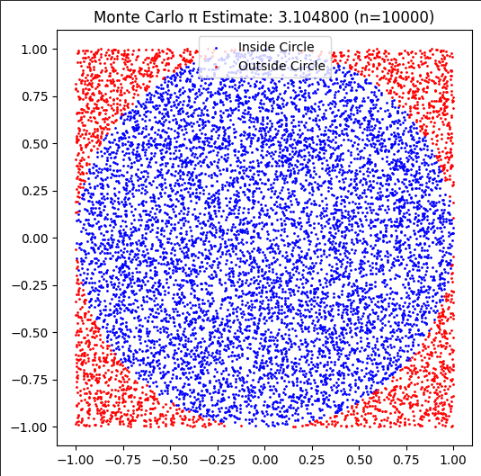
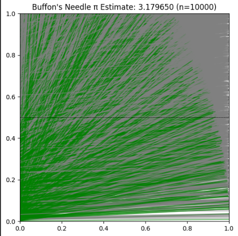

# 2️⃣


# Estimating π Using Monte Carlo Methods

## 1. Problem Statement

Monte Carlo simulations use randomness to solve mathematical problems. One of the most elegant uses is estimating the value of π. We will explore two approaches:

1. Estimating π using a circle.
2. Estimating π using Buffon’s Needle experiment.

---

## 2. Part 1: Estimating π Using a Circle

### 1. Theoretical Foundation

We simulate random points in a square that bounds a unit circle (radius = 1). The area of the circle is $ \pi r^2 $, and the square’s area is $ (2r)^2 = 4 $. The ratio gives:

$
\frac{\text{Points inside circle}}{\text{Total points}} \approx \frac{\pi}{4} \Rightarrow \pi \approx 4 \cdot \frac{\text{Points inside}}{\text{Total points}}
$

---

### 2. Simulation

We generate random points $(x, y)$ in the square $[-1, 1] \times [-1, 1]$, then count how many fall inside the circle using the condition:

$
x^2 + y^2 \leq 1
$

---

### 3. Python Implementation

```python
import numpy as np
import matplotlib.pyplot as plt

def monte_carlo_pi(n_points):
    x = np.random.uniform(-1, 1, n_points)
    y = np.random.uniform(-1, 1, n_points)
    inside = x**2 + y**2 <= 1
    pi_estimate = 4 * np.sum(inside) / n_points

    plt.figure(figsize=(6,6))
    plt.scatter(x[inside], y[inside], color='blue', s=1, label='Inside Circle')
    plt.scatter(x[~inside], y[~inside], color='red', s=1, label='Outside Circle')
    plt.title(f"Monte Carlo π Estimate: {pi_estimate:.6f} (n={n_points})")
    plt.gca().set_aspect('equal')
    plt.legend()
    plt.show()

    return pi_estimate
```

---

### 4. Visualization


---

### 5. Analysis

- As the number of points increases, the estimate becomes more accurate.
- Convergence rate is approximately $ \mathcal{O}(1/\sqrt{N}) $.
- Simple to implement, but requires many iterations for high accuracy.

---

## Part 2: Estimating π Using Buffon’s Needle

### 1. Theoretical Foundation

Buffon’s Needle problem estimates π from the probability of a needle crossing lines spaced at distance $ d $, using a needle of length $ l \leq d $.

$
P = \frac{2l}{\pi d} \Rightarrow \pi \approx \frac{2l \cdot N}{d \cdot H}
$

Where:
- $ N $: total needle drops
- $ H $: number of hits (crossings)

---

### 2. Simulation

A needle crosses a line if:

$
\frac{l}{2} \cdot \sin(\theta) \geq \text{distance from center to nearest line}
$

---

### 3. Python Implementation

```python
def buffon_needle(n_drops, l=1.0, d=2.0):
    hits = 0
    xs, ys, angles = [], [], []
    for _ in range(n_drops):
        center_y = np.random.uniform(0, d/2)
        theta = np.random.uniform(0, np.pi / 2)
        if (l / 2) * np.sin(theta) >= center_y:
            hits += 1
        xs.append(center_y)
        ys.append(theta)
        angles.append(theta)

    pi_estimate = (2 * l * n_drops) / (d * hits) if hits != 0 else 0

    plt.figure(figsize=(6, 6))
    for i in range(n_drops):
        y0 = xs[i]
        angle = angles[i]
        x_start = 0
        x_end = np.cos(angle)
        y_start = y0
        y_end = y0 + np.sin(angle)
        color = 'green' if (l / 2) * np.sin(angle) >= y0 else 'gray'
        plt.plot([x_start, x_end], [y_start, y_end], color=color, alpha=0.6)

    for i in range(5):
        plt.axhline(i * d / 4, color='black', linestyle='--', linewidth=0.5)

    plt.title(f"Buffon's Needle π Estimate: {pi_estimate:.6f} (n={n_drops})")
    plt.xlim(0, 1)
    plt.ylim(0, d/2)
    plt.show()

    return pi_estimate
```

---

### 4. Visualization



---

### 5. Analysis

- Buffon’s method converges slowly compared to the circle method.
- Physically inspired and useful for demonstrating probabilistic geometry.
- Useful for introducing students to the intersection of geometry and probability.

---

## Convergence Analysis

To compare both methods:

1. Run multiple trials (e.g., with 100, 1,000, 10,000, 100,000 iterations).
2. Track estimated π values.
3. Plot error vs. number of iterations.

*Insert table or plot comparing convergence of both methods here.*

---

## ✅ Conclusion

- **Circle-based Monte Carlo** is more accurate per iteration.
- **Buffon’s Needle** is slower but more interesting geometrically.
- Both show how randomness and geometry can estimate fundamental constants.

---

[MyColab](https://colab.research.google.com/drive/1CFJ_4NRtj9A94cJfHfjWg8sAwGcoUq_c)